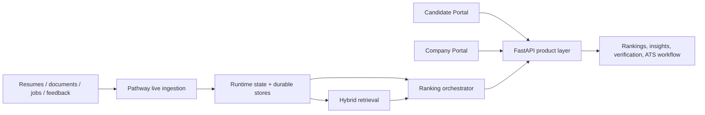

# PulseHire

PulseHire is a real-time AI recruitment platform built for the Pathway real-time RAG challenge. It combines continuous ingestion, live ranking, grounded recruiter insights, candidate verification, and a split product experience for both candidates and hiring teams.

The final build is organized around two production-style entry points:

- Candidate Portal
- Company Portal

Both portals share the same live backend, so resume uploads, role updates, recruiter feedback, verification decisions, and candidate-company messages are reflected across the system without manual reprocessing.

## Final product highlights

### Real-time ingestion with Pathway

- Resumes, roles, and recruiter feedback are ingested through Pathway-backed live streams.
- New or changed data updates the runtime state and triggers fresh role rankings.
- There is no batch rebuild step for normal product use.

### Candidate Portal

- Candidate sign in and sign up
- Company selection from live backend workspaces
- Multi-role application flow
- Ordered application journey:
  1. Upload photo
  2. Add resume or build profile
  3. Upload supporting documents
  4. Submit application
- Saved structured profile
- Separate Feedback and Messages sections
- Match score hidden until recruiter verification is completed
- Role-specific recruiter notes, verification outcomes, and company replies

### Company Portal

- Company sign in
- Role-first workflow
- Candidate list scoped to the selected role only
- Candidate details workspace
- Resume replacement and candidate removal
- Recruiter reviews and shortlist Q&A
- Verification review with visible candidate documents
- Role-scoped analytics
- Candidate-company messaging
- Match score explanation, skill-family coverage, comparison, and what-if analysis

### Explainable ranking

Each role ranking combines:

- retrieval evidence
- must-have fit
- experience fit
- education fit
- recruiter signal
- stability and confidence adjustments

Recruiters can see:

- why selected
- why not selected
- missing skills
- decision signal
- comparison between finalists

### Verification-aware product behavior

- Candidates do not see the match score until the hiring team verifies their submission for that role.
- Companies can review uploaded profile photos and proof documents in the candidate details workspace.
- Verification decisions are written back to the candidate portal automatically.

## Architecture



Detailed architecture notes are in [docs/architecture.md](C:\Users\user\Downloads\ml hackathon\docs\architecture.md).

## Core challenge alignment

### 1. Real-Time Data Ingestion and Processing

- Continuous ingestion for resumes, jobs, and recruiter feedback
- Pathway-backed streaming updates
- Live reranking when evidence changes

### 2. Resume Understanding and Information Extraction

- Resume parsing for `PDF`, `DOCX`, `TXT`, and `CSV`
- Structured extraction for skills, experience, education, projects, and certifications
- Skill grouping and evidence-aware candidate profiles

### 3. Dynamic Candidate Ranking with Pathway RAG

- Role-specific ranking snapshots
- Hybrid retrieval plus structured scoring
- Retrieval-grounded explanations and comparisons

### 4. Real-Time Update and Adaptive Re-Ranking

- New resumes change rankings
- Role edits change rankings
- Recruiter feedback changes rankings
- Verification decisions change candidate-visible outcomes

## Product workflow

### Candidate Portal

1. Sign in or create a candidate account
2. Select a company
3. Select one or more open roles
4. Upload a profile photo
5. Add a resume or build a structured profile
6. Upload supporting proof documents
7. Submit the application
8. Track feedback, verification, and messages role by role

### Company Portal

1. Sign in to a company workspace
2. Select a role first
3. Review role-scoped candidates only
4. Open candidate details
5. Inspect documents and verification summary
6. Verify or reject supporting proof
7. Add recruiter feedback
8. Compare finalists and use shortlist intelligence

## Seeded access for review and demo

### Candidate accounts

- `Aditi Sharma` / `Aditi@201588`
- `Karthik Rao` / `Karthik@201588`
- `Priya Nair` / `Priya@201588`
- `Rahul Menon` / `Rahul@201588`

### Company accounts

- `Aurora Analytics` / `AuroraAnalytics@201588`
- `Blueorbit Health` / `BlueorbitHealth@201588`
- `Meridian Retail AI` / `MeridianRetailAI@201588`
- `Novaforge Systems` / `NovaforgeSystems@201588`
- `Quantumnest Cloud` / `QuantumnestCloud@201588`

Notes:

- `IIT Bhubaneswar` is preserved as an existing workspace and is not overwritten by the seeded demo-company passwords.
- The seeded candidate accounts are created from the real backend resumes already present in the repository.

## Run locally

### 1. Environment

```powershell
copy .env.example .env
```

### 2. Start the stack

```powershell
powershell -ExecutionPolicy Bypass -File .\scripts\start_pulsehire.ps1
```

You can also use:

```cmd
.\start_pulsehire.cmd
```

### 3. Open the product

- API: `http://localhost:8000`
- UI: `http://localhost:8501`

### 4. Stop the stack

```powershell
powershell -ExecutionPolicy Bypass -File .\scripts\stop_pulsehire.ps1
```

## Validation


- Dockerized tests: `30/30` passed
- UI: `http://localhost:8501` returned `200`
- API: `http://localhost:8000` returned `200`
- Live authenticated smoke scenario passed:
  - candidate company discovery
  - role-specific application creation
  - profile photo upload
  - supporting document upload
  - company-side document visibility
  - verification review
  - recruiter feedback delivery
  - candidate-company messaging
  - candidate-side message deletion reflected in company view
  - candidate and company match-score parity after verification
  - match score visible only after verification

### Validation commands

```powershell
$env:DOCKER_CONFIG='C:\Users\user\Downloads\ml hackathon\artifacts\docker-config'
docker compose exec -T api python -m unittest discover -s tests -v
```

## Key API surfaces

### Candidate portal

- `POST /candidate/auth/register`
- `POST /candidate/auth/login`
- `GET /candidate/companies`
- `GET /candidate/companies/{company_id}/roles`
- `GET /candidate/profile`
- `POST /candidate/profile`
- `POST /candidate/documents`
- `GET /candidate/documents`
- `POST /candidate/applications`
- `GET /candidate/applications`
- `GET /candidate/conversations`
- `POST /candidate/conversations`
- `DELETE /candidate/conversations/{message_id}`

### Company portal

- `POST /auth/login`
- `GET /jobs`
- `GET /jobs/{job_id}/rankings`
- `GET /jobs/{job_id}/insights`
- `GET /jobs/{job_id}/compare`
- `GET /candidates/{candidate_id}/documents`
- `GET /candidates/{candidate_id}/verification`
- `POST /candidates/{candidate_id}/verification/review`
- `GET /candidates/{candidate_id}/conversations`
- `POST /candidates/{candidate_id}/conversations`
- `POST /feedback`
- `GET /events/stream`

